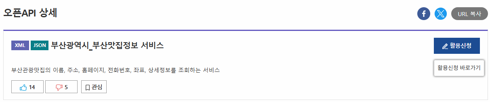

# WPF-Busanfood
부산광역시 부산맛집 정보앱

## 1일차
### 부산광역시 부산맛집 정보앱
1. [데이터포털](https://data.go.kr) OpenAPI 신청

    

2. WPF 프로젝트 생성
3. NuGet 패키지 라이브러리 설치
    - CommunityToolkit.Mvvm
    - MahApps.Metro / MahApps.Metro.IconPacks
    - Newtonsoft.Json
    - CefSharp.Wpf.NETCore (플랫폼 x64로 변경!)
    - NLog 

3. MVVM 초기화
4. UI 디자인 및 구현
   
https://github.com/user-attachments/assets/3140e832-7952-4e2d-937b-5db624aed469

## 2일차

### 부산광역시 부산맛집 정보앱 (계속)
1. 그리드 표현 아이템 조정
2. 메인창내용을 구글맵창으로 이동
3. CefSharp.Wpf로 구글맵지도 표현
4. 위도(Latitude), 경도(Longitude) 표현

    https://github.com/user-attachments/assets/2c64ccf1-a17a-424a-80b8-d14986211e4a
